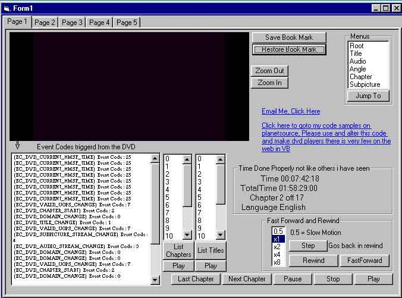

## About the MSWEB DVD Sample player

### Description

Retrieves & lists EventCodes from DVD, how to implement a timer properly with no timer control, zoom, menus, & identify domains with .UOPValid method before executing an event on the DVD.

includes

.CurrentDomain

.UOPValid

.ShowMenu

.DeleteBookmark

.SaveBookmark

.RestoreBookmark

.PlayChapter

.PlayState

DVD_DVDNotify event codes
 
### More Info
 

             |
---                |---
**Submitted On**   |2002-01-12 12:57:24
**By**             |[Jamie Pocock](https://github.com/Planet-Source-Code/PSCIndex/blob/master/ByAuthor/jamie-pocock.md)
**Level**          |Intermediate
**User Rating**    |4.9 (34 globes from 7 users)
**Compatibility**  |VB 6\.0
**Category**       |[DirectX](https://github.com/Planet-Source-Code/PSCIndex/blob/master/ByCategory/directx__1-44.md)
**World**          |[Visual Basic](https://github.com/Planet-Source-Code/PSCIndex/blob/master/ByWorld/visual-basic.md)
**Archive File**   |[About\_the\_481731122002\.zip](https://github.com/Planet-Source-Code/jamie-pocock-about-the-msweb-dvd-sample-player__1-30717/archive/master.zip)

